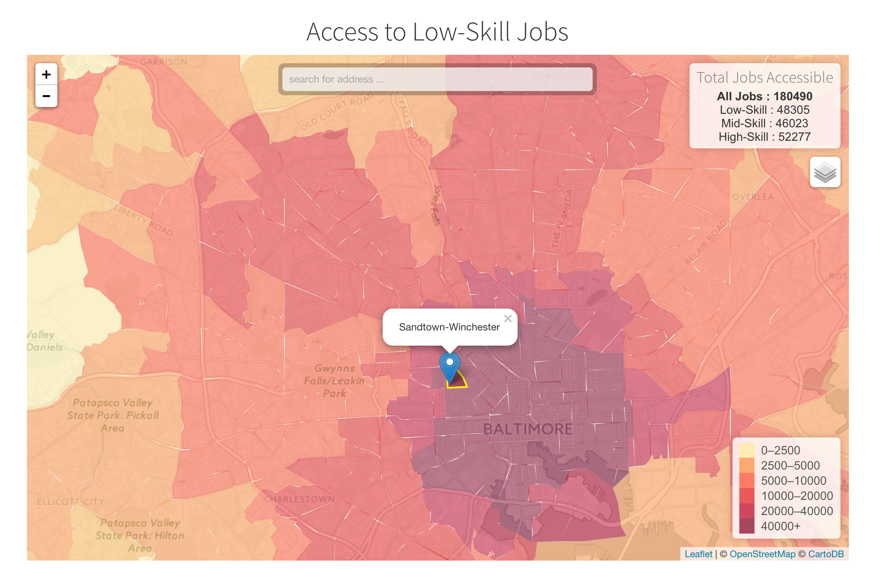

Maryland Job Accessibility
==========================

This repository contains the code necessary to recreate the analysis

[here](http://knaaptime.com/projects/spatial-mismatch)

You will need a scientific python distribution like [Anaconda](https://www.continuum.io/downloads), and the [geopandas,](http://geopandas.org/) and [pandana](http://udst.github.io/pandana/) libraries.

To run the analysis, extract the contents of the data.7z archive to the root of this folder,
then cd into this directory and run the script with `python access_to_jobs.py`

